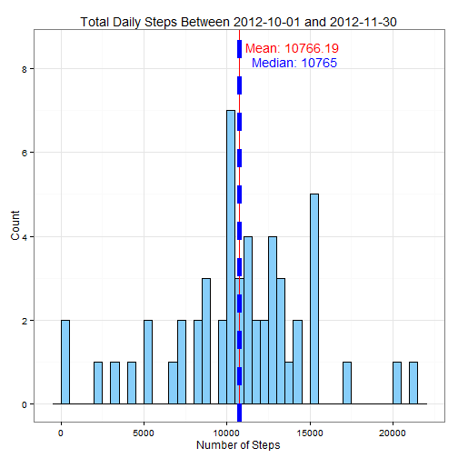
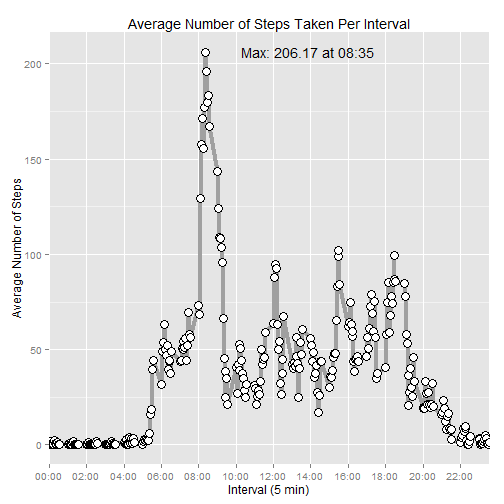
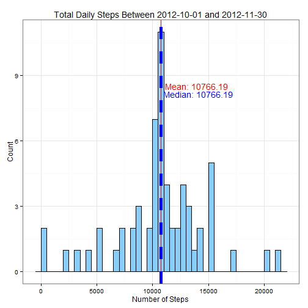
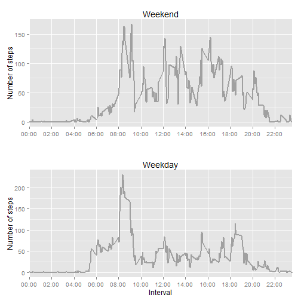

Overview
========
The following script is used to load, clean and analyze data retrieved from a personal activity monitoring decice and is the first of two assignments that form part of the Coursera Reproducible Research course.

The data can be found in the activity.csv file found in the activity.zip file included in the repository. The file contains 17,568 observations that include the following 3 variables
* **steps:** Number of steps taking in a 5-minute interval
* **date:** The date on which the measurement was taken in YYYY-MM-DD format
* **interval:** Identifier for the 5-minute interval in which measurement was taken

Assignment
---------------------------------
The assignment consist of loading and analysing the data and generating graphs and finding insights in the dataset. The following sections provide the R code as well as a step by step description of the tasks and the resulting output.

Loading and preprocessing the data
========
### Load the required libraries


```r
library(ggplot2)
library(Hmisc)
require(gridExtra)
```

### Load the required files 

```r
# Get the working directory and ensure that the required files exist
path = getwd()

#message(paste("Current path is:",path))

if (!file.exists(paste(path,'activity.zip', sep='/'))) {
  stop("Could not find the specified folder. Please update the path above")
}

# Unzip the file
unzip('activity.zip', overwrite=TRUE)
```

### Read the data

```r
# Read the data into a variable
data <- read.csv('activity.csv')
```

### Explore the data

```r
# Check the structure of the data
str(data)
```

```
## 'data.frame':	17568 obs. of  3 variables:
##  $ steps   : int  NA NA NA NA NA NA NA NA NA NA ...
##  $ date    : Factor w/ 61 levels "2012-10-01","2012-10-02",..: 1 1 1 1 1 1 1 1 1 1 ...
##  $ interval: int  0 5 10 15 20 25 30 35 40 45 ...
```
The dates are seen as factors lets convert them to dates

```r
data$date <- as.Date(data$date)
str(data)
```

```
## 'data.frame':	17568 obs. of  3 variables:
##  $ steps   : int  NA NA NA NA NA NA NA NA NA NA ...
##  $ date    : Date, format: "2012-10-01" "2012-10-01" ...
##  $ interval: int  0 5 10 15 20 25 30 35 40 45 ...
```
Looking at a summary of the data it should be noted that there are NA's in the steps variable

```r
summary(data)
```

```
##      steps            date               interval   
##  Min.   :  0.0   Min.   :2012-10-01   Min.   :   0  
##  1st Qu.:  0.0   1st Qu.:2012-10-16   1st Qu.: 589  
##  Median :  0.0   Median :2012-10-31   Median :1178  
##  Mean   : 37.4   Mean   :2012-10-31   Mean   :1178  
##  3rd Qu.: 12.0   3rd Qu.:2012-11-15   3rd Qu.:1766  
##  Max.   :806.0   Max.   :2012-11-30   Max.   :2355  
##  NA's   :2304
```

What is mean total number of steps taken per day?
=================
We can ignore missing values for this question so let's remove them

```r
completeCases <- data[complete.cases(data),]

# Calculate the total number of steps for each day and view a summary of the result
totals <- aggregate(steps ~ date, data = completeCases, FUN= "sum")
head(totals)
```

```
##         date steps
## 1 2012-10-02   126
## 2 2012-10-03 11352
## 3 2012-10-04 12116
## 4 2012-10-05 13294
## 5 2012-10-06 15420
## 6 2012-10-07 11015
```


```r
#Function is used to generate a histogram
createDailyTotalsHist <- function (df) {
  # Define labels and defaults for later use in the charts
  title <- "Total Daily Steps Between 2012-10-01 and 2012-11-30"
  meanLabel <- paste("Mean:", round(mean(df$steps), digits=2))
  medianLabel <- paste("Median:", round(median(df$steps), digits=2))
  
  ggplot(df, aes(x=steps)) + geom_histogram(colour="black", fill="#87CEFA", binwidth = 500) +
      labs(title=title, y="Count", x="Number of Steps") +
      geom_vline(aes(xintercept=mean(steps)),
                 color="red", linetype="solid", size=0.5) +
      geom_vline(aes(xintercept=median(steps)),
                 color="blue", linetype="dashed", size=2) + 
                 theme_bw() +
      annotate("text", x = 14000, y = 8.5, label = meanLabel, size=5, color="red") +
      annotate("text", x = 14100, y = 8.15, label = medianLabel, size=5, color="blue")
}

createDailyTotalsHist(totals)
```

 

The above histogram shows the total number of steps between 2012-10-01 and 2012-11-30. The mean and median can also be seen on the plot, indicated in red and blue lines.

What is the average daily activity pattern?
==================================================
We will ignore missing values for this question as well. Note that the result shows the average accross all days broken down by interval.


```r
completeCases <- data[complete.cases(data),]

# Calculate the mean for each interval accross all days
means <- aggregate(steps ~ interval, data = completeCases, FUN= "mean")
head(means)
```

```
##   interval   steps
## 1        0 1.71698
## 2        5 0.33962
## 3       10 0.13208
## 4       15 0.15094
## 5       20 0.07547
## 6       25 2.09434
```

### Define defaults

```r
# Function converts a interval into a time eg from 835 to 08:35
lookupTime <- function (interval) {
  #Use dummy dates to build up a list of 5 minute intervals for 24 hours 
  start <- as.POSIXlt("2010-01-01 00:00:00") 
  end <- as.POSIXlt("2010-01-02 00:00:00") 
  
  times <- c()
  
  while (start < end) {
    if (as.numeric(format(start, "%H%M")) == interval) {
      return(format(start, "%H:%M"))
    }

    start = start + (5*60)
  }
} 

#Build a vector containing a list of 2 hourly intervals eg 02:00, 04:00, 06:00 etc
getHours <- function () {
  start <- as.POSIXlt("2010-01-01 00:00:00") 
  end <- as.POSIXlt("2010-01-02 00:00:00") 
  
  times <- c()
  
  while (start < end) {
    times <- c(times, format(start, "%H:%M"))
    start = start + (2*60*60)
  }
  
  times
} 

# Find the interval with the max average steps as well as the time associated with the interval  
maxIndex <- which.max(means[,2] )
maxInterval <- means[maxIndex,1]
maxTime <- lookupTime(maxInterval)
maxSteps <- max(means$steps)

#Create labels for use when generating the plot
maxLabel <- paste("Max:", round(max(means$steps), digits=2), 'at', maxTime)
title <- 'Average Number of Steps Taken Per Interval' 
xlabels <- getHours()
xlabelBreaks <- seq(0,2300, 200)
```
### Draw Plot
Draw a line chart showing the average numberof steps taken per interval accross all days  

```r
ggplot(data=means, aes(x=interval, y=steps)) + 
    labs(title=title, y="Average Number of Steps", x="Interval (5 min)") +
    scale_x_discrete(breaks=xlabelBreaks, labels=xlabels) +
    geom_line(colour="#A0A0A0", size=1.5) + 
    geom_point(colour="black", size=4, shape=21, fill="white") + 
    annotate("text", x=maxInterval+550, y=maxSteps, label = maxLabel, size=5)
```

 

Imputing missing values
===================================
Note the number of missing observations with missing (NA) values

```r
length(which(is.na(data)))
```

```
## [1] 2304
```

Impute missing values by assigning the mean of each period to the missing value
Eg. If a missing value appears on interval 0 for day 1 then the average of all the interval 0's 
across all days will be used.

```r
# First we remove any NAs
completeCases <- data[complete.cases(data),]

# Then we calculate the mean for each interval across all days
means <- aggregate(steps ~ interval, data = data, FUN= "mean")
head(means)
```

```
##   interval   steps
## 1        0 1.71698
## 2        5 0.33962
## 3       10 0.13208
## 4       15 0.15094
## 5       20 0.07547
## 6       25 2.09434
```

```r
# Function returns the average steps based on the interval for that observation
replaceNa <- function(observation) {

  #If the observation contains NA then impute the value by looking up the mean
  #for that interval
  if (is.na(observation['steps'])) {
    interval <- as.integer(observation['interval'])
    value <- means[means$interval == interval,2]
    observation['steps'] = as.numeric(value)
  }
  
  #Else return the actual value
  observation['steps']
}

data$imputed <- apply(data, 1, replaceNa)
data$steps <- sapply(data$imputed, function(x) { as.numeric(x)})
head(data)
```

```
##     steps       date interval            imputed
## 1 1.71698 2012-10-01        0   1.71698113207547
## 2 0.33962 2012-10-01        5  0.339622641509434
## 3 0.13208 2012-10-01       10  0.132075471698113
## 4 0.15094 2012-10-01       15  0.150943396226415
## 5 0.07547 2012-10-01       20 0.0754716981132075
## 6 2.09434 2012-10-01       25   2.09433962264151
```
Note that there are no NAs left

```r
length(which(is.na(data)))
```

```
## [1] 0
```

Now that missing values were imputed lets calculate the daily totals again and compare
the resulting historgram with the one created in the first step

```r
# Calculate the total number of steps for each day and view a summary of the result
imputedTotals <- aggregate(steps ~ date, data = data, FUN= "sum")
createDailyTotalsHist(imputedTotals)
```

 

Even though the mean and median is more or less the same we can see a big difference in the 
frequency that values appear between the first histogram and the one above. This higlights
the importance of choosing the correct imputation strategy for your data set as it may
severly skew your results.


Are there differences in activity patterns between weekdays and weekends?
==================================================
Add a column that indicates if the observation was taken on a week day or weekend day

```r
#Assign a column conaining Weekend or Weekday
data$dayofweek <- weekdays(data$date) 
data$type <- as.factor(ifelse(data$dayofweek %in% c("Saturday","Sunday"), "Weekend", "Weekday")) 
```
Calculate the average number of steps taken per period

```r
#Apply the mean for each set of data
weekdays <- aggregate(steps ~ interval, data = data[data$type == "Weekday",], FUN= "mean") 
weekends <- aggregate(steps ~ interval, data = data[data$type == "Weekend",], FUN= "mean")
```
Create the two charts to compare steps on weekend days and steps on weekdays

```r
createPlot <- function(df, description, xlbl) {
  linePlot <- ggplot(data=df, aes(x=interval, y=steps)) +
      geom_line(colour="#A0A0A0", size=0.8) +
      labs(title=description, y="Number of steps", x=xlbl) +
      scale_x_discrete(breaks=xlabelBreaks, labels=xlabels)
      
  linePlot  
}

plot1 <- createPlot(weekends, 'Weekend', '')
plot2 <- createPlot(weekdays, 'Weekday', 'Interval')

grid.arrange(plot1,plot2, nrow=2)
```

 

